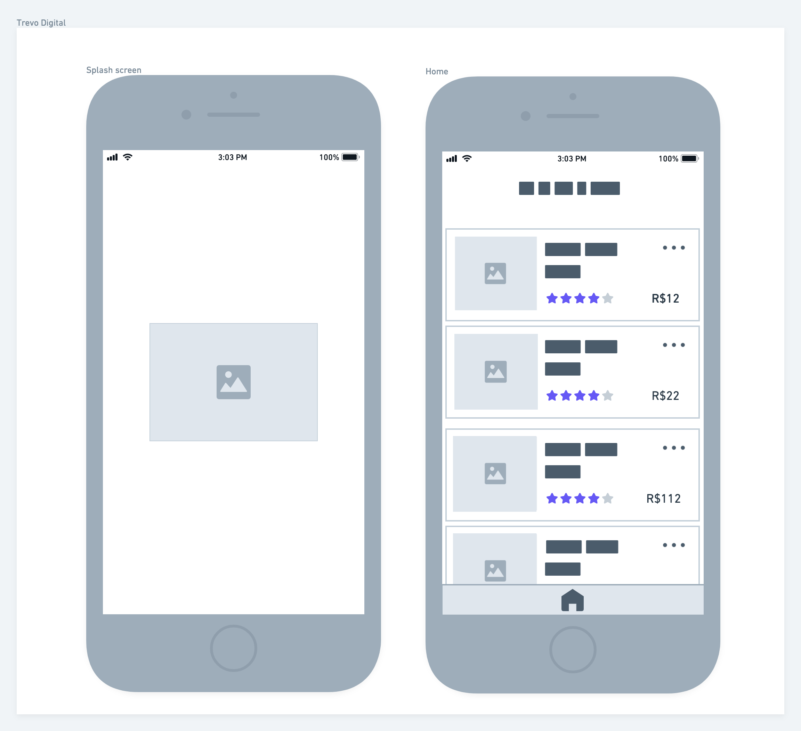

# Design Challenge 20201215

## Introdução

Este é um desafio para testar seus conhecimentos de Design e Prototipação;

Neste desafio existem várias formas de desenvolver e obter os resultados propostos. O objetivo é avaliar a sua forma de estruturação e autonomia em decisões para construir algo escalável.

### Antes de começar

- Considere como deadline 5 dias a partir do início do desafio. Caso tenha sido convidado a realizar o teste e não seja possível concluir dentro deste período, avise a pessoa que o convidou para receber instruções sobre o que fazer.
- Documentar todo o processo de investigação para o desenvolvimento da atividade; os resultados destas tarefas são tão importantes do que o seu processo de pensamento e decisões à medida que as completa, por isso tente documentar e apresentar os seus hipóteses e decisões na medida do possível.

## Desafio / Case

A empresa Trevo Digital atua com diversos clientes a nível global em mais de 15 países, uma das principais características da empresa é o forte posicionamento no setor digital com uma equipe focada na geração de leads de qualidade.
Por isso, todos os projetos devem ser muito bem estruturados pensando em SEO, fluidez e reuso (componentes reutilizados em vários projetos).
O seu objetivo é criar um projeto que dê atenção aos requisitos anteriormente mencionados.

## Recursos

1. Utilizar alguma ferramenta de design online de colaboração. Ex: Figma

## Passo a Passo

Neste desafio trabalhamos na elaboração de uma estrutura inicial do Design System e no desenvolvimento de dois protótipos mobile e web das telas do projeto de e-commerce de um novo Cliente da Trevo Digital.

Antes de começar a trabalhar, a equipe de análises e requisitos desenvolveu o WireFrame inicial da versão mobile do projeto:

Para trabalhar o protótipo, devemos seguir a paleta de cores que o cliente enviou:

### Design System

O Design System do projeto será um esboço inicial com:

- Tipos de Fontes
- Cores
- Componentes

### Versão Mobile

Para desenvolver as telas do Mobile, devemos revisar se a UI e UX está correta antes de trabalhar no protótipo. Com seus conhecimentos, revise a proposta e aplique as devidas correções que você achar necessária para melhorar a usabilidade do projeto.

### Versão Desktop

Não foi desenvolvido proposta de Wireframe para versão desktop, por isso deveremos elaborá-la seguindo a estrutura da versão mobile, mas aplicando os devidos ajustes para a nova versão.

Alguns elementos importantes que temos na versão mobile:

- Imagem produto
- Título
- Valoração
- Preço
- Botão de mais opções

> Dica: Uma diferença entre as versões seria a paginação.

### Extras

- **Diferencial 1** Criar a proposta visual da tela de detalhes de produto
- **Diferencial 2** Prototipar o Modal de avaliação na versão Desktop  

## Finalização e Instruções para a Apresentação

Avisar sobre a finalização e enviar para correção.

1. Confira se você respondeu o Scorecard anexado na Vaga que se candidatou;
2. Confira se você respondeu o Mapeamento anexado na Vaga que se candidatou;
3. Acesse [https://coodesh.com/challenges/review](https://coodesh.com/challenges/review);
4. Adicione o repositório com a sua solução;
5. Grave um vídeo, utilizando o botão na tela de solicitar revisão da Coodesh, com no máximo 5 minutos, com a apresentação do seu projeto. Utilize o tempo para:
- Explicar o objetivo do desafio
- Quais tecnologias foram utilizadas
- Foque em pontos obrigatórios e diferenciais quando for apresentar.
6. Adicione o link da apresentação do seu projeto no README.md.
7. Verifique se o Readme está bom e faça o commit final em seu repositório;
8. Confira a vaga desejada;
9. Envie e aguarde as instruções para seguir no processo. Sucesso e boa sorte. =)

## Suporte

Use a [nossa comunidade](https://discord.gg/rdXbEvjsWu) para tirar dúvidas sobre o processo ou envie uma mensagem diretamente a um especialista no chat da plataforma. 
